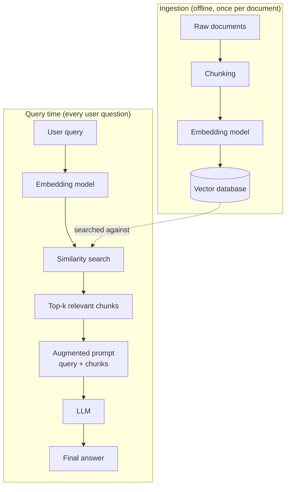

# Understanding RAG (Retrieval-Augmented Generation)

## Why RAG exists
LLM Problems: 
 - Cut Off Knowledge: 
 - Context Limitation: can't pass context in every prompt
 - Don't know information which not avaialble on the internet (e.g company private papers)

RAG Solve this problems by providing enough context to LLM to produce better result.

*RAG Components* 
 - Chunking: Split document in smaller chunks using overlap method or fixed size chunks (there are more method available for chunking)
 - Embedding: Convert this small chunks into vectors (number repesentation)
 - Vector database: store this embedding into vector store, responsible for to retriving chunks based on user query.
 - User Query: Embed user query and pass to vector database for similarity seach and vector store returns the Top-k tokens
 - Augmented: Pass retrived chunks to LLM + user query
 - LLM: return the output based on provided chunks

